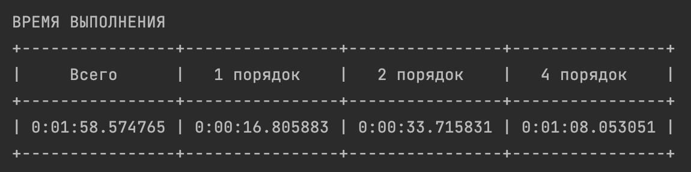
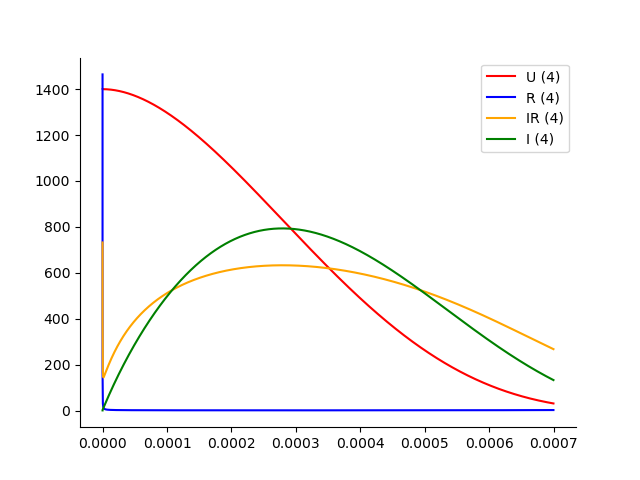
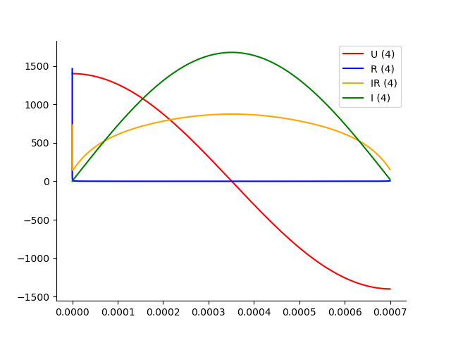
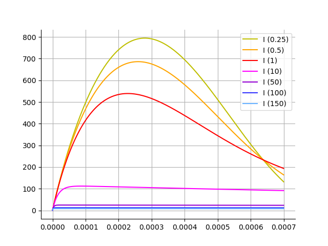
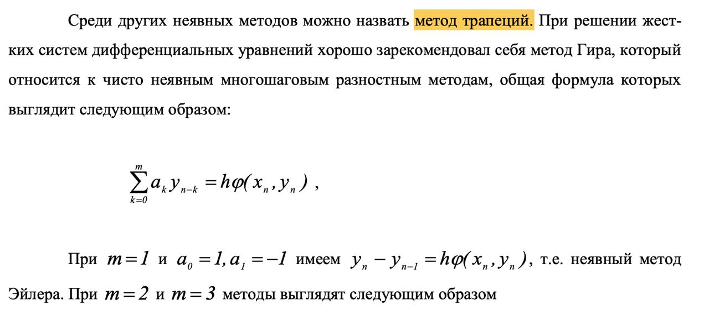
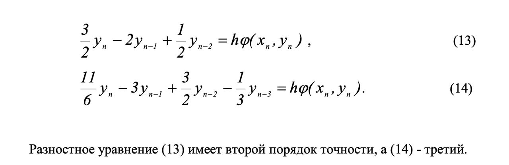
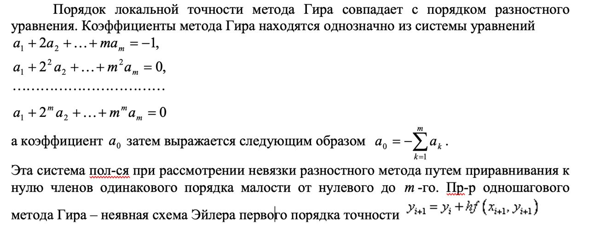
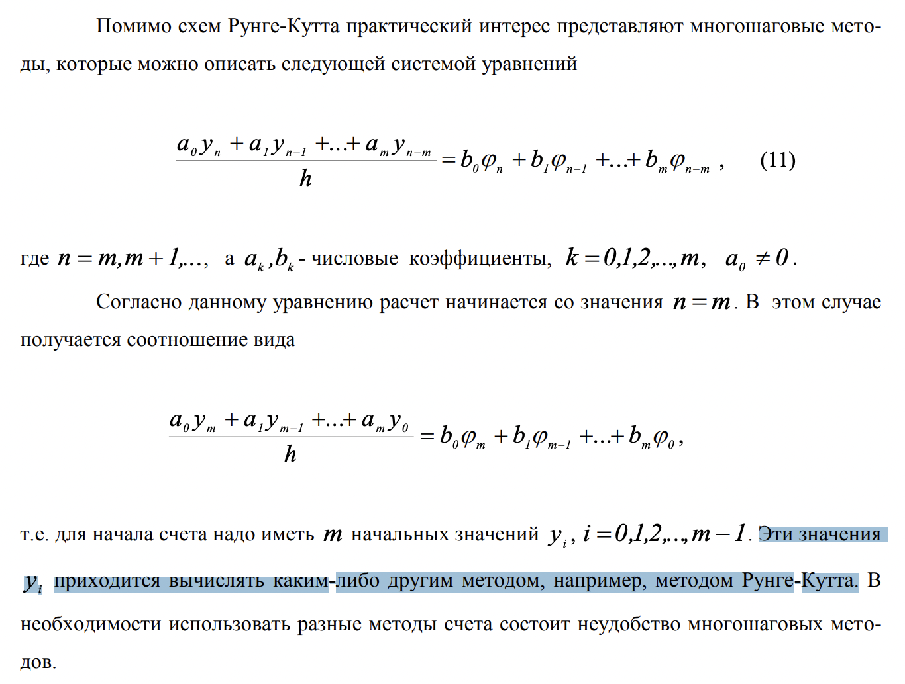
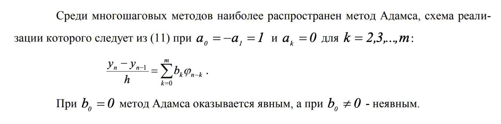

## Лабораторная работа №2

### Время выполнения алгоритмов

### Общий график 

Получается одинаковым (визуально) для всех порядков точности

### Контроль результатов

1. Разработать программу, провести выбор шага по времени, **обеспечивающего относительную погрешность 0.001**

   > программу разработали, но как искать погрешность это вопрос открытый 👀

2. Построить графики зависимости от времени импульса t: при заданных выше параметрах. Продемонстрировать, **как влияет выбор метода на шаг сетки**

   > опять же графики построили, но как влияет выбор метода 👀

3. График зависимости `I(t)` при `Rk + Rp = 0` . Обратить внимание на то, что в этом случае колебания тока будут не затухающими. Сравнить с аналитическим решением

   Колебания незатухающие, так как, когда у нас нет сопротивления, то ток просто бегает от одной пластины к другой.

   

4. График зависимости `I(t)` при больших сопротивлениях, например, `Rk = 200 Ом` в интервале значений t 0-20 мкс

   Если заряд большой, то мы тратим ток на пробег по сопротивлению.

   

### Контрольные вопросы

1. Какие способы тестирования программы можно предложить?

   > 📍 в прод выкатим, там посмотрим

2. Получите систему разностных уравнений для решения сформулированной задачи неявным методом трапеций. Опишите алгоритм реализации полученных уравнений.

   У нас есть y0 по условию. Берем уравнение при m = 1 -> находим y1. Потом берем m = 2 -> находим y2 и т.д.

   

   

   

3. Из каких соображений проводится выбор того или иного численного метода, учитывая, что чем выше порядок точности метода, тем он более сложен в реализации и требует больших затрат времени при счете?

   > Порядок точности выбирается следующим образом: если функция `f(x, y)` в правой части уравнения **ограничена** и **непрерывна**, а также непрерывны и ограничены ее i-е производные, то наилучший результат достигается при i-ой схеме (можно вместо i сказать 4).

   > При этом понятно, что увеличивать порядок до бесконечности тупо, поэтому скорее всего нужно поставить некоторый eps и сравнивать результаты методов с ним (как только достигаем нужной точности -- значит ок)

4. Какие изменения надо внести в программу, чтобы перейти на использование многошагового метода Адамса?

   > есть мнение, что метод Адамса идет поверх метода Рунге-Кутта (сначала дано найти все точки методом РК, потом применить к ним Адамса)

   

   

5. Напишите формулы метода Рунге-Кутта 4-го порядка точности для численного решения системы уравнений

   > 📍

6. Приведите оценку погрешности использованных методов на примере дифференциального уравнения со специальной правой частью

   > 📍

7. Какие можно предложить способы ускорения процедуры интерполяции по таблицам 1,2?

   > 📍