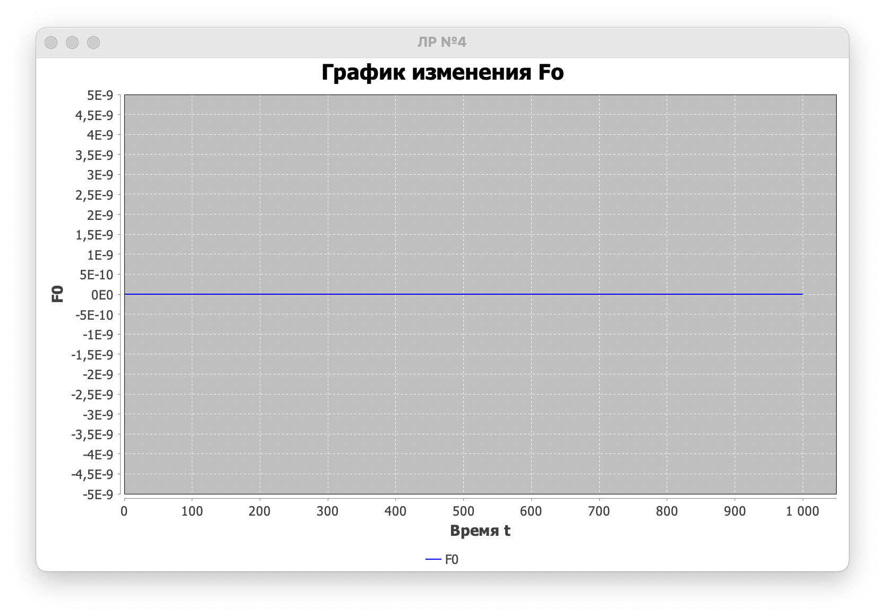
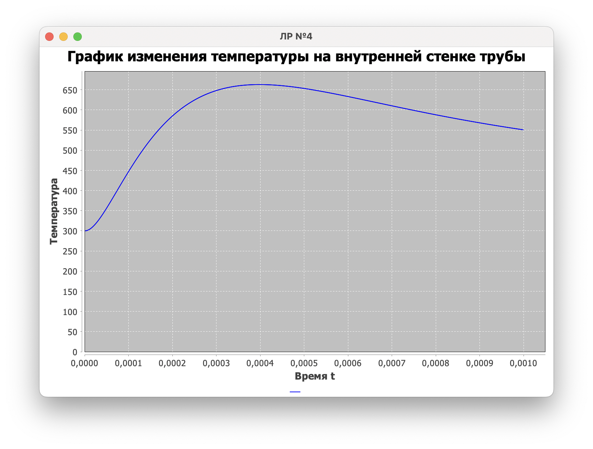
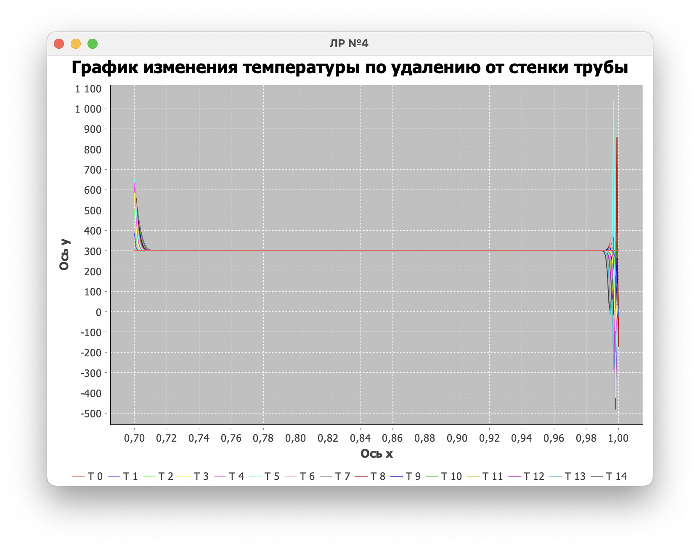

## Лабораторная работа №4

### Результаты

**Вариант 1**

Когда `F0` определен следующим образом:

```java
if (t < 100) {
    return 100;
}
else {
    return 0;
}
```

А параметры следующим:
```java
tau = 3
for (double i = 0; i < 200; i += mod.tau)
```

Получили


**Вариант 2**

Когда `F0` определен следующим образом:

```java
return Fmax / tmax * t * Math.exp(-(t / tmax - 1));
```

А параметры следующим:
```java
tau = 1e-6
for (double i = 0; i < 1e-3; i += mod.tau)
```

Получили





